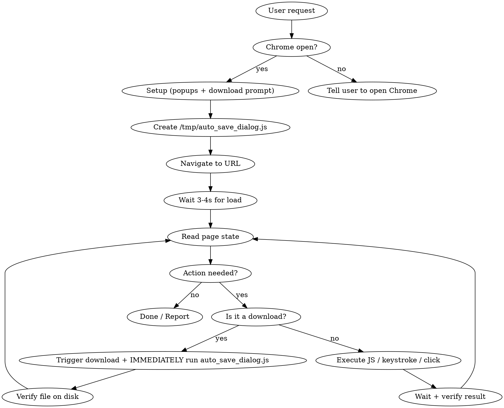

# Browser Navigation via AppleScript

Control the user's real Chrome browser (with cookies, passwords, sessions) using AppleScript and JXA. **Not detected as a bot** — unlike CDP/Playwright, this uses OS-level automation.

## Prerequisites

Chrome must have **"Allow JavaScript in AppleScript Events"** enabled:
- Menu bar → **Présentation** → **Options pour les développeurs** → check the option
- Must be on a web page tab (not chrome:// settings) for the menu to appear

## Setup & Teardown

**At the START of any navigate session**, configure Chrome for automation:
```python
import json, os
PREFS = os.path.expanduser('~/Library/Application Support/Google/Chrome/Default/Preferences')
with open(PREFS) as f: prefs = json.load(f)

p = prefs.setdefault('profile', {}).setdefault('default_content_setting_values', {})
dl = prefs.setdefault('download', {})

orig_popups = p.get('popups', 2)
orig_prompt = dl.get('prompt_for_download', False)
cs = prefs.setdefault('content_settings', {}).setdefault('exceptions', {})
orig_popup_exceptions = cs.get('popups', {}).copy()

needs_restart = False

# Enable popups globally (needed for downloads/auth)
if orig_popups != 1:
    p['popups'] = 1
    needs_restart = True

# IMPORTANT: Clear site-specific popup exceptions — they override the global setting
if cs.get('popups'):
    cs['popups'] = {}
    needs_restart = True

# Enable download prompt — REQUIRED for blob/JS downloads to work
# Without this, blob-created downloads are silently dropped by Chrome
if not orig_prompt:
    dl['prompt_for_download'] = True
    needs_restart = True

if needs_restart:
    with open(PREFS, 'w') as f: json.dump(prefs, f)
    os.system('osascript -e \'tell application "Google Chrome" to quit\'')
    import time; time.sleep(2)
    os.system('open -a "Google Chrome"')
    time.sleep(3)
    print('Chrome configured: popups=ALLOW, download_prompt=ON')
else:
    print('Chrome already configured, no restart needed')
```

**At the END of the session**, restore original settings:
```python
restore = {}
if orig_popups != 1: restore['popups'] = orig_popups
if orig_popup_exceptions: restore['popup_exceptions'] = orig_popup_exceptions
if not orig_prompt: restore['prompt_for_download'] = False

if restore:
    with open(PREFS) as f: prefs = json.load(f)
    if 'popups' in restore:
        prefs['profile']['default_content_setting_values']['popups'] = restore['popups']
    if 'popup_exceptions' in restore:
        prefs['content_settings']['exceptions']['popups'] = restore['popup_exceptions']
    if 'prompt_for_download' in restore:
        prefs['download']['prompt_for_download'] = restore['prompt_for_download']
    with open(PREFS, 'w') as f: json.dump(prefs, f)
    print('Chrome settings RESTORED')
```

**Key points:**
- `prompt_for_download = True` is MANDATORY — without it, blob/JS downloads silently fail
- This means **every download triggers a save dialog** → use the download helper (pattern 9)
- Chrome MUST be restarted for settings to take effect
- Track original values to restore correctly at the end

## Core Patterns

### 1. Navigate to URL
```bash
osascript -e 'tell application "Google Chrome" to set URL of active tab of front window to "https://example.com"'
```

### 2. Read page state
```bash
osascript -e 'tell application "Google Chrome" to execute active tab of front window javascript "document.title"'
```

### 3. Execute complex JS — Use JXA files

**ALWAYS use JXA for multi-line JS.** AppleScript string escaping breaks with quotes and special chars.

```javascript
// /tmp/script.js — run with: osascript -l JavaScript /tmp/script.js
var chrome = Application('Google Chrome');
var tab = chrome.windows[0].activeTab();

var result = tab.execute({javascript: `
    (function() {
        // Your JS here — use backtick templates, no escaping issues
        var inputs = document.querySelectorAll('input');
        return Array.from(inputs).map(i => i.placeholder).join(', ');
    })()
`});
result;
```

### 4. Keyboard input (via System Events)
```javascript
var se = Application('System Events');
se.keystroke('hello');           // Type text
se.keyCode(36);                  // Enter
se.keyCode(51);                  // Delete
se.keystroke('a', {using: 'command down'});  // Cmd+A
```

### 5. Tab management
```javascript
var chrome = Application('Google Chrome');
var win = chrome.windows[0];
// New tab
win.make({new: 'tab', withProperties: {URL: 'https://example.com'}});
// Switch tab
var tabs = win.tabs();
for (var i = 0; i < tabs.length; i++) {
    if (tabs[i].url().indexOf('target') > -1) {
        win.activeTabIndex = i + 1;
        break;
    }
}
```

### 6. Click elements
```javascript
tab.execute({javascript: `
    document.querySelector('button.submit').click();
`});
```

### 7. Fill forms
```javascript
tab.execute({javascript: `
    var input = document.querySelector('input[name="email"]');
    input.value = 'test@example.com';
    input.dispatchEvent(new Event('input', {bubbles: true}));
`});
```

### 8. Chrome menu interaction
```javascript
var se = Application('System Events');
var proc = se.processes['Google Chrome'];
// List menus
proc.menuBars[0].menus().map(m => m.name());
// Click menu item
proc.menuBars[0].menus.byName('File').menuItems.byName('Print').click();
```

### 9. Download files — ALWAYS use this pattern

**CRITICAL: Since `prompt_for_download = True`, EVERY download triggers a save dialog.**
**You MUST run the save dialog handler after ANY action that triggers a download.**
**Forgetting this = the download hangs forever waiting for user input.**

The pattern is: **trigger download → immediately run auto-save script**.

**Step 1: Save this reusable auto-save script at session start:**
```bash
cat > /tmp/auto_save_dialog.js << 'DLEOF'
// Auto-click Save/Enregistrer on Chrome's download save dialog
// Run with: osascript -l JavaScript /tmp/auto_save_dialog.js
var se = Application('System Events');
var saved = false;
for (var attempt = 0; attempt < 40; attempt++) {
    try {
        var proc = se.processes['Google Chrome'];
        var wins = proc.windows();
        for (var w = 0; w < wins.length; w++) {
            var sheets = wins[w].sheets();
            if (sheets.length > 0) {
                // IMPORTANT: sheets[0].buttons does NOT list the Save button!
                // Must use entireContents() to find it.
                var all = sheets[0].entireContents();
                for (var i = all.length - 1; i >= 0; i--) {
                    try {
                        if (all[i].role() === 'AXButton') {
                            var nm = all[i].name();
                            if (nm === 'Save' || nm === 'Enregistrer') {
                                all[i].click();
                                saved = true;
                                break;
                            }
                        }
                    } catch(e2) {}
                }
                if (saved) break;
            }
        }
        if (saved) break;
    } catch(e) {}
    delay(0.5);
}
saved ? 'SAVED' : 'NO_DIALOG_FOUND';
DLEOF
```

**Step 2: Every time you trigger a download, IMMEDIATELY run the auto-save:**
```bash
# Example: click a download button, then auto-save
osascript -l JavaScript /tmp/trigger_download.js && osascript -l JavaScript /tmp/auto_save_dialog.js
```

Or combine in one script:
```javascript
// /tmp/download_and_save.js
var chrome = Application('Google Chrome');
var tab = chrome.windows[0].activeTab();

// 1. Trigger the download (adapt selector to your case)
tab.execute({javascript: `document.querySelector('a[download], button:has-text("Download")').click()`});

// 2. Immediately handle the save dialog
var se = Application('System Events');
var saved = false;
for (var attempt = 0; attempt < 40; attempt++) {
    try {
        var proc = se.processes['Google Chrome'];
        var wins = proc.windows();
        for (var w = 0; w < wins.length; w++) {
            var sheets = wins[w].sheets();
            if (sheets.length > 0) {
                var all = sheets[0].entireContents();
                for (var i = all.length - 1; i >= 0; i--) {
                    try {
                        if (all[i].role() === 'AXButton') {
                            var nm = all[i].name();
                            if (nm === 'Save' || nm === 'Enregistrer') {
                                all[i].click();
                                saved = true;
                                break;
                            }
                        }
                    } catch(e2) {}
                }
                if (saved) break;
            }
        }
        if (saved) break;
    } catch(e) {}
    delay(0.5);
}
saved ? 'DOWNLOAD_SAVED' : 'NO_DIALOG_AFTER_20s';
```

**Key points:**
- `sheets[0].buttons` returns scrollbar buttons, NOT Save/Cancel — use `entireContents()`
- Iterate from the end (`all.length - 1`) — Save is typically the last AXButton
- Check ALL windows (not just `windows[0]`) — dialog may be on a different window
- Poll up to 40 × 0.5s = 20 seconds for the dialog to appear
- **NEVER trigger a download without immediately running this handler**

### 10. Multi-file download permissions
Chrome shows a permission bar ("Allow site to download multiple files?") when a site triggers several downloads. Auto-accept it:
```javascript
var se = Application('System Events');
var proc = se.processes['Google Chrome'];
// The permission bar is a group in the Chrome window — look for "Allow"/"Autoriser" button
var groups = proc.windows[0].groups;
for (var g = 0; g < groups.length; g++) {
    try {
        var btns = groups[g].buttons;
        for (var b = 0; b < btns.length; b++) {
            var name = btns[b].name();
            if (name === 'Allow' || name === 'Autoriser') {
                btns[b].click();
                break;
            }
        }
    } catch(e) {}
}
```
Note: This may not always work — some permission bars require manual user click. Tell the user to click "Allow"/"Autoriser" if automation fails.

## Workflow



## Important Patterns

**Always wait after navigation:** `delay(3)` or `sleep 3` before reading page.

**Use JXA files for anything beyond one-liners.** Write JS to `/tmp/scriptname.js`, run with `osascript -l JavaScript /tmp/scriptname.js`. AppleScript inline JS with escaped quotes WILL break on complex code.

**Read page content efficiently:**
```javascript
// Get overview of interactive elements
tab.execute({javascript: `
    (function() {
        var r = 'URL: ' + location.href + '\\nTITLE: ' + document.title + '\\n';
        document.querySelectorAll('input,button,a,select,textarea').forEach(function(el, i) {
            var desc = el.tagName + ' ' + (el.type||'') + ' ' + (el.name||'') + ' ' + (el.placeholder||'') + ' ' + el.textContent.trim().substring(0,40);
            r += i + ': ' + desc.trim() + '\\n';
        });
        r += '\\nTEXT:\\n' + document.body.innerText.substring(0, 2000);
        return r;
    })()
`});
```

**Downloads go to Chrome's configured download directory** — not always ~/Downloads. Check with `find ~ -name "*.pdf" -newer /tmp/marker -not -path "*/Library/*"` after downloading.

**EVERY download needs auto_save_dialog.js:** Since `prompt_for_download = True` (required for blob downloads), Chrome shows a save dialog on EVERY download. You MUST run `/tmp/auto_save_dialog.js` immediately after triggering any download. No exceptions. See pattern #9.

**Multi-file downloads:** Chrome blocks multiple rapid downloads — use pattern #10 to auto-accept, or tell user to click "Allow"/"Autoriser" manually if automation fails.

**Corporate proxies (MCAS):** Some sites use `*.mcas.ms` URLs. Outlook downloads may require accepting a Chrome permission bar manually.

**SSO/2FA:** When sites require app confirmation (e.g., Revolut), tell the user and wait.

## Common Mistakes

| Mistake | Fix |
|---------|-----|
| Inline AppleScript with complex JS | Use JXA file instead |
| Not waiting after navigation | Always `delay(3)` minimum |
| Searching in wrong context (Google vs site) | Verify search box is focused with JS before typing via System Events |
| Assuming ~/Downloads | Check Chrome's actual download directory |
| Trying CDP/DevTools for real sites | Use AppleScript — undetectable |
| **Triggering download without running auto_save_dialog.js** | **ALWAYS run `/tmp/auto_save_dialog.js` immediately after ANY download trigger. The save dialog WILL appear and block forever if not handled. This is the #1 most common mistake.** |
| Setting `prompt_for_download = False` | NEVER do this — blob/JS downloads silently fail. Keep it `True` and use auto_save_dialog.js |
| **Using Print / window.print() / Cmd+P** | **NEVER use print. The macOS print dialog blocks AppleScript with a -1712 timeout error and cannot be automated. Instead, save page content as HTML and convert to PDF with `textutil`+`cupsfilter`, or take a screenshot.** |
| Ignoring multi-file download prompt | Auto-accept or tell user to click Allow (pattern #10) |
